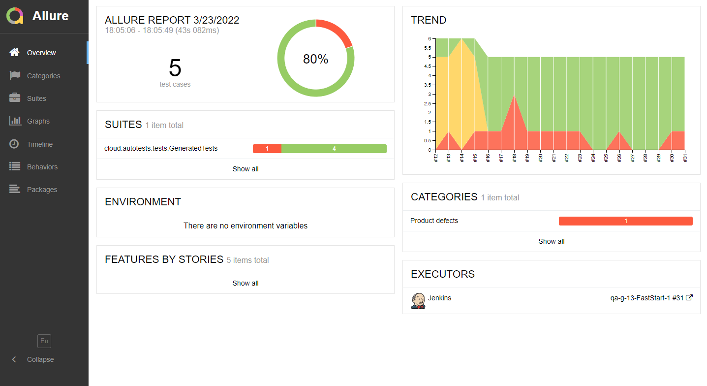
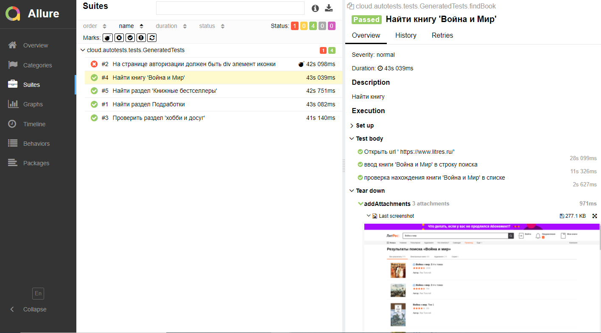
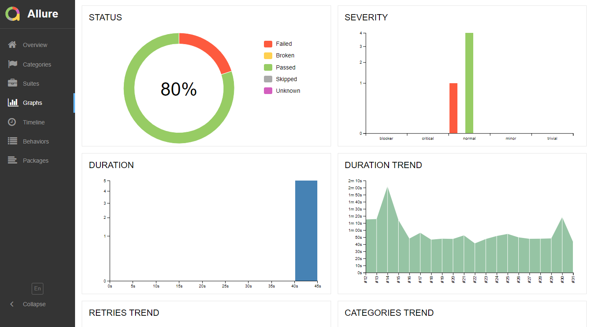
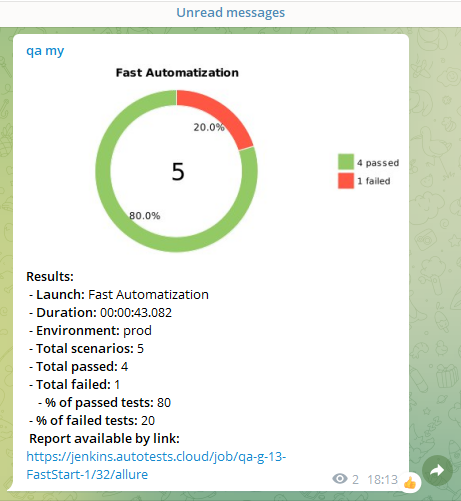

#King test automation project

## :page_with_curl:	Content

> :heavy_check_mark: [Covered functionality](#earth_africa-covered-functionality)
>
> :heavy_check_mark: [Technology stack](#classical_building-technology-stack)
>
> :heavy_check_mark: [Running tests from the terminal](#running-tests-from-the-terminal)
>
> :heavy_check_mark: [Running Tests in Jenkins](#robot-remote-test-running)
>
> :heavy_check_mark: [Test results report in Allure Report](#skier-main-page-of-allure-report)
>
> :heavy_check_mark: [Telegram notifications using a bot](#-telegram-notifications-using-a-bot)
>
> :heavy_check_mark: [An example of running a test in Selenoid](#-an-example-of-running-a-test-in-selenoid)


## :technologist: Covered functionality

> UI autotests developed <code>UI</code>.
### UI

- [x] Work page title test
- [x] No errors in page console log
- [x] Page title should have header text
- [x] Blog page title test
- [x] Service page title test
- [x] Job page title test
- [x] Berlin office address information verification
- [x] Zurich office address information verification

## :classical_building: Technology stack

<p align="center">


</p>

In this project, autotests are written in <code>Java</code> using <code>Selenide</code> for UI tests.
>
> <code>Selenoid</code> launches browsers in <code>Docker</code> containers.
>
> <code>Allure Report</code> generates a test run report.
>
> <code>Gradle</code> is used for automated project build.
>
> <code>JUnit 5</code> is used as a unit testing library.
>
> <code>Jenkins</code> runs the tests.
>
> After the run is completed, notifications are sent using the bot to <code>Telegram</code>.


## Running tests from the terminal

### :robot: Running Tests Locally

```
gradle clean test
```

### :robot: Remote test running
## </a> Jenkins <a target="_blank" href="https://jenkins.autotests.cloud/job/AUTO-760/"> job </a>

```
clean
test
-Dbrowser=${BROWSER}
-DbrowserVersion=${BROWSER_VERSION}
-DbrowserSize=${BROWSER_SIZE}
-DbrowserMobileView="${BROWSER_MOBILE}"
-DremoteDriverUrl=https://user1:1234@${REMOTE_DRIVER_URL}/wd/hub/
-DvideoStorage=https://${REMOTE_DRIVER_URL}/video/
-Dthreads=${THREADS}
```

### :robot: Build Options

> <code>REMOTE_URL</code> – the address of the remote server where the tests will run.
>
> <code>BROWSER</code> – the browser the tests will be run (_default - <code>chrome</code>_).
>
> <code>BROWSER_VERSION</code> – version of the browser the tests will be run (_default - <code>91.0</code>_).
>
> <code>BROWSER_SIZE</code> – the size of the browser window the tests will be run (_default - <code>1920x1080</code>_).


### :pushpin: Main page of <a target="_blank" href="https://jenkins.autotests.cloud/job/AUTO-760/18/allure/">Allure-report</a>

<p align="center">

</p>

### :pushpin: Grouping tests by tested functionality

<p align="center">

</p>


### :pushpin: Main dashboard

<p align="center">

</p>


##  Telegram notifications using a bot

> After the build is completed, a special bot created in <code>Telegram</code> automatically processes and sends a message with a run report.

<p align="center">

</p>

##  An example of running a test in Selenoid

> A video is attached to each test in the report. One of these videos is shown below.
<p align="center">
  
</p>
